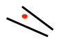

&copy;Copyright for [Shuang Wu] [2017] 
Cite from the [coursera] named [Neural network for Machine Learning] from [University of Toronto] 
Learning notes 
- [Why object recognition is difficult](#why-object-recognition-is-difficult)
    - [Things that make it hard to recognize objects](#things-that-make-it-hard-to-recognize-objects)
    - [More things that make it hard to recognize objects](#more-things-that-make-it-hard-to-recognize-objects)
- [Ways to achieve viewpoint invariance](#ways-to-achieve-viewpoint-invariance)
    - [Some ways to achieve viewpoint invariance](#some-ways-to-achieve-viewpoint-invariance)
    - [The invariant feature approach](#the-invariant-feature-approach)
    - [The judicious normalization approach](#the-judicious-normalization-approach)
    - [The brute force normalization approach](#the-brute-force-normalization-approach)
- [Convolutional neural networks for hand-written digit recognition](#convolutional-neural-networks-for-hand-written-digit-recognition)
    - [The replicated feature approach](#the-replicated-feature-approach)
        - [currently the dominant approach for neural networks](#currently-the-dominant-approach-for-neural-networks)
    - [Backpropagation w/ weight constraints](#backpropagation-w-weight-constraints)
    - [What does replicating the feature detectors achieve](#what-does-replicating-the-feature-detectors-achieve)
    - [Pooling the outputs of replicated feature detectors](#pooling-the-outputs-of-replicated-feature-detectors)
    - [Le Net](#le-net)
    - [The architecture of LeNet5](#the-architecture-of-lenet5)
    - [The 82 errors made by LeNet5](#the-82-errors-made-by-lenet5)
    - [Priors and prejudice](#priors-and-prejudice)
    - [The brute force approach](#the-brute-force-approach)
    - [The errors made by the Ciresan et. al. net](#the-errors-made-by-the-ciresan-et-al-net)
    - [How to detect a significant drop in the error rate](#how-to-detect-a-significant-drop-in-the-error-rate)
- [Convolutional neural networks for object recognition](#convolutional-neural-networks-for-object-recognition)
    - [From hand-written digits to 3-D objects](#from-hand-written-digits-to-3-d-objects)
    - [The ILSVRC-2012 competition on ImageNet](#the-ilsvrc-2012-competition-on-imagenet)
    - [Examples from the test set (w/ the nework's guesses)](#examples-from-the-test-set-w-the-neworks-guesses)
    - [Error rates on the ILSVRC-2012 competition](#error-rates-on-the-ilsvrc-2012-competition)
    - [A neural network for ImageNet](#a-neural-network-for-imagenet)
    - [Tricks that significantly improve generalization](#tricks-that-significantly-improve-generalization)
    - [The hardware required for Alex's net](#the-hardware-required-for-alexs-net)
    - [Finding roads in high-resolution images](#finding-roads-in-high-resolution-images)

# Why object recognition is difficult

## Things that make it hard to recognize objects
* **_Segmentation_**: real scenes are cluttered w/ other objects:
    * hard to tell which pieces go together as parts of the same object
    * parts of an object can be hidden behind other objects
* _**Lighting**_: The intensities of the pixels are determined as much by the lighting as by the objects
* _**Deformation**_: Objects can deform in a variety of non-affine ways
    * e.g. a hand-written 2 can have a large loop or just a cusp
* _**Affordances**_: Object classes are often defined by how they are used:
    * chairs are things designed for sitting on so they have a wide variety of physical shapes

## More things that make it hard to recognize objects
* _**Viewpoint**_: changes in view point cause changes in images that standard learning methods cannot cope with
    * Info. hops b/w input dimensions (i.e. pixels)
    * 
* Imagine a medical database in which the age of a patient sometimes hops to the input dimension that normally codes for weight
    * to apply machine learning would first want to eliminate this dimension-hopping

# Ways to achieve viewpoint invariance

## Some ways to achieve viewpoint invariance
* we are so good at viewpoint invariance that it is hard to appreciate how difficult it is
    * its one of the main difficulties in making computers perceive
    * still don't have generally accepted solutions
* several different approaches
    * use redundant invariant features
    * put a box around the object and use normalized pixels
    * [Lecture 5c](#convolutional-neural-networks-for-hand-written-digit-recognition): Use replicated features w/ pooling. This is called "CNN"
    * use a hierarchy of parts that have explicit poses relative to the camera (this will be described in detail later in the course)

## The invariant feature approach
* Extract a large, redundant set of features that are invariant under transformations
    * pair of roughly parallel lines w/ a red dot b/w them
    * 
    * this is what baby herring gulls use to know where to peck for food
* w/ enough invariant features, there is only one way to assemble them into an object
    * don't need to represent the relationships b/w features directly because they are captured by other features
* But for recognition, must avoid forming features from parts of different objects

## The judicious normalization approach
* put a box around the object and use it as a coordinate frame for a set of normalized pixels
    * this solves the dimension-hopping problem. If choose the box correctly, the same part of an object always occurs on the same normalized pixels
    * the box can provide invariance to many degrees of freedom: translation, rotation, scale, shear, stretch...
    * 
* But choosing the box is difficult b/c of:
    * segmentation errors, occlusion, unusual orientations
* need to recognize the shape to get the box right

## The brute force normalization approach
* when training the recognizer, use well-segmented, upright images to fit the correct box
* at test time try all possible boxes in a range of positions and scales
    * this approach is widely used for detecting upright things like factes and house numbers in unsegmented images
    * it is much more efficient if the recognizer can cope w/ some variation in position and scale so that we can use a coarse grid when trying all possible boxes

# Convolutional neural networks for hand-written digit recognition

## The replicated feature approach
### currently the dominant approach for neural networks
* Use many different copies of the same feature detector w/ different positions
    * could also replicate across scale and orientation
        * (tricky and expensive)
    * replication greatly reduces the # of free parameters to be learned
    * 
* Use several different feature types, each w/ its own map of replicated detectors
    * allows each patch of image to be represented in several ways

## Backpropagation w/ weight constraints
* It's easy to modify the backprop alg. to incorporate linear constraints b/w the weights
* compute the gradients as usual, and then modify the gradients so they satisfy the constraints
    * if the weights started off satisfying the constraints, they will continue to satisfy them
* To constrain: $w_1=w_2$
* we need: $\Delta w_1=\Delta w_2$
* compute: $\frac{\partial E}{\partial w_1}$ and $\frac{\partial E}{\partial w_2}$
* use $\frac{\partial E}{\partial w_1}+\frac{\partial E}{\partial w_2}$ for $w_1$ and $w_2$

## What does replicating the feature detectors achieve
* _**Equivariant activities**_: Replicated features do not make the neural activities invariant to translation. The activities are equivariant
* 
* _**Invariant knowledge**_: if a feature is useful in some locations during training, detectors for that feature will be available in all locations during testing

## Pooling the outputs of replicated feature detectors
* Get a small amount of translational invariance at each level by averaging four neighboring replicated detectors to give a single output to the next level
    * This reduces the number of inputs to the next layer if feature extraction, thus allowing us to have many more different feature maps
    * taking the maximum of the four works slightly better
* Problem: After several levels of pooling, we have lost information about the precise positions of things
    * this make it impossible to use the precise spatial relationships b/w high-level parts for recognition

## Le Net
* Yann LeCun and his collaborators developed a really good recognizer for handwritten digits by using backprop. in a feedforward net with:
    * many hidden layers
    * many maps of replicated units in each layer
    * pooling of the outputs of nearby replicated units
    * A wide net that can cope w/ several characters at once even if they overlap
    * A clever way of training a complete system, not just a recognizer
* This net was used for reading ~10% of the checks in north america
* look the impressive demos of LENET at [here](http://yann.lecun.com)

## The architecture of LeNet5

## The 82 errors made by LeNet5
* Notice that most of the errors are cases that people find quite easy
* The human error rate is probably 20 to 30 errors but nobody has had the patience to measure it
* 

## Priors and prejudice

* can put our prior knowledge about the task into the network by designing appropriate:
    * connectivity
    * weight constraints
    * neuron activation functions
* This is less intrusive than hand-designing the features
    * but it still prejudices the network towards the particular way of solving the problem that we had in mind
* Alternatively, can use our prior knowledge to create a whole lot more training data
    * this may require a lot of word
    * may make learning take much longer
* it allows optimization to discover clever ways of using the multi-layer network that did not think of
    * may never fully understand how it does it

## The brute force approach
* LeNet uses knowledge about the invariances to design:
    * the local connectivity
    * the weight-sharing
    * the pooling
* this achieves about 80 errors
    * this can be reduced to about 40 errors by using many different transformations of the input and other tricks
* Ciresan et. al. inject knowledge of invariances by creating a huge amount of carefully designed extra training data:
    * for each training image, they produce many new training examples by applying many different transformations
    * they can then train a lrage, deep, dumb net on a GPU w/o much overfitting
* They achieve about 35 errors

## The errors made by the Ciresan et. al. net
* The top printed digit is the right answer, the bottom two printed digits are the network's best two guesses
* The right answer is almost always in the top 2 guesses
* with model averaging they can now get about 25 errors
* 

## How to detect a significant drop in the error rate
* Is 30 errors in 10,000 test cases significantly better than 40 errors?
    * it all depends on the particular errors
    * the Mcnemar test uses the particular errors and can be much more powerful than a test that just uses the number of errors
    * 

# Convolutional neural networks for object recognition
## From hand-written digits to 3-D objects
* Recognizing real objects in color photographs downloaded from the web is much more complicated than recognizing hand-written digits
    * Hundred times as many classes (1000 vs 10)
    * Hundred times as many pixels (256*256 color vs 28*28 gray)
    * Two dimensional image of three dimensional scene
    * cluttered scenes requiring segmentation
    * multiple objects in each image
* will the same type of CNN work?

## The ILSVRC-2012 competition on ImageNet
* The dataset has 1.2 million high-resolution training images
* The classification task:
    * get the "correct" class in your top 5 bets. there are 1000 classes
* The localization task:
    * for each bet, put a box around the object. Your box must have at least 50% overlap w/ the correct box
* some of the best existing computer vision methods were tried on this dataset by leading computer vision groups from Oxford, INRIA, XRCE, ...
    * computer vision systems use complicated multi-stage systems
    * the early stages are typically hand-tuned by optimizing a few parameters

## Examples from the test set (w/ the nework's guesses)
* 

## Error rates on the ILSVRC-2012 competition
Group name | classification | classification  & localization
------- | ------- | -------
University of Tokyo | 26.1% | 53.6%
Oxford University Computer Vision Group | 26.9% | 50.0% | 
INRIA (French national research institute in CS) +  XRCE (Xerox Research Center Europe) | 27.0% | 
University of Amsterdam | 29.5% |  | 
												
## A neural network for ImageNet
* Alex Krizhevsky developed a very deep CNN of the type pioneered by Yann LeCun. Its architecture was:
    * 7 hidden layers not counting some map pooling layers
    * The early layers were convolutional
    * the last two layers were globally connected
* The activation functions were:
    * Rectified linear units in every hidden layer. These train much faster and are more expressive than logistic units
    * Competitive normalization to suppress hidden activities when nearby units have stronger activities. This helps w/ variations in intensity

## Tricks that significantly improve generalization
* Train on random 224*244 patches from the 256*256 images to get more data. Also use left-right reflections of the images
    * At test time, combine the opinions from ten different patchesL the four 224*244 corner patches plus the central 224*224 patch plus the reflections of those five patches
* Use "dropout" to regularize the weights in the globally connected layers (which contain most of the parameters)
    * dropout means that half of the hidden units in a layer are randomly removed for each training example
    * this stops hidden units from relying too much on other hidden units

## The hardware required for Alex's net
* He uses a very efficient implementation of convolutional nets on two Nvidia GTX 580 Graphics Processor Units (over 1000 fast little cores)
    * GPUs are very good for matrix-matrix multiplies
    * GPUs have very high bandwidth to memory
    * this allows him to train the network in a week
    * It also makes it quick to combine results from 10 patches at test time
* Can spread a network over many cores if we can communicate the states fast enough
* As cores get cheaper and datasets get bigger, big NN will improve faster than old-fashioned computer vision systems

## Finding roads in high-resolution images
* Vlad Mnih used a non-convolutional net w/ local fields and multiple layers of rectified linear units to find roads in cluttered aerial images
    * it takes a large image patch and predicts a binary road label for the central 16*16 pixels
    * there is lots of labeled training data available for this task
* The task is hard for many reasons:
    * occlusion by building trees and cards
    * shadows, lighting changes
    * Minor viewpoint change
* The worst problems are incorrect labels
    * badly registered maps
    * arbitrary decisions about what counts as a road
* Big neural nets trained on big image patches with millions of examples are the only hope
* 

