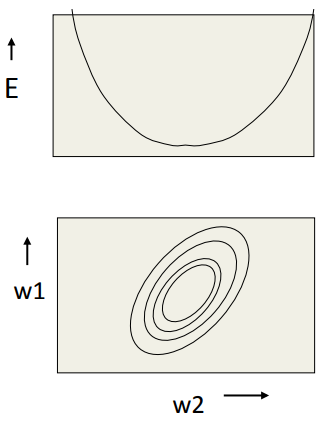
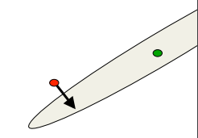
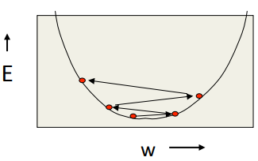
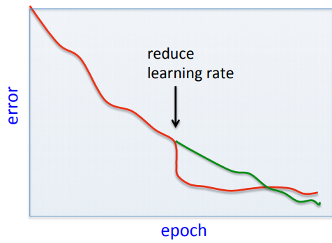
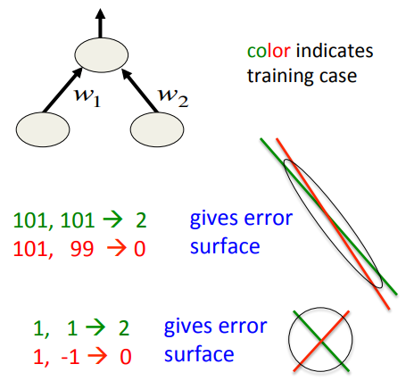
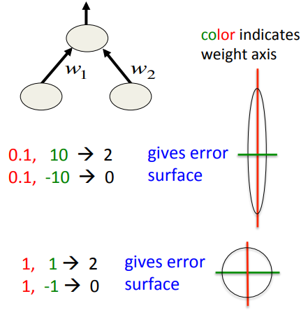
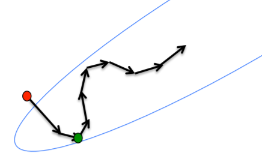
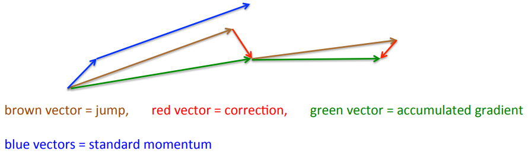
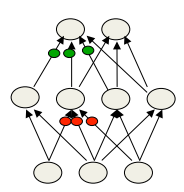

&copy;Copyright for [Shuang Wu] [2017] 
Cite from the [coursera] named [Neural network for Machine Learning] from [University of Toronto] 
Learning notes 
- [Overview of mini-batch gradient descent](#overview-of-mini-batch-gradient-descent)
    - [Reminder: The error surface for a linear neuron](#reminder-the-error-surface-for-a-linear-neuron)
    - [Convergence speed of full batch learning when the error surface is quadratic bowl](#convergence-speed-of-full-batch-learning-when-the-error-surface-is-quadratic-bowl)
    - [How the learning goes wrong](#how-the-learning-goes-wrong)
    - [Stochastic gradient descent](#stochastic-gradient-descent)
    - [Two types of learning algorithm](#two-types-of-learning-algorithm)
    - [A basic mini-batch gradient descent algorithm](#a-basic-mini-batch-gradient-descent-algorithm)
- [A bag of tricks for mini-batch gradient descent](#a-bag-of-tricks-for-mini-batch-gradient-descent)
    - [Be careful about turning down the learning rate](#be-careful-about-turning-down-the-learning-rate)
    - [Initializing the weights](#initializing-the-weights)
    - [Shifting the inputs](#shifting-the-inputs)
    - [Scaling the inputs](#scaling-the-inputs)
    - [A more thorough method: Decorrelate the input components](#a-more-thorough-method-decorrelate-the-input-components)
    - [Common problems that occur in multilayer networks](#common-problems-that-occur-in-multilayer-networks)
    - [4 ways to speed up mini-batch learning](#4-ways-to-speed-up-mini-batch-learning)
- [The momentum method](#the-momentum-method)
    - [The intuition behind the momentum method](#the-intuition-behind-the-momentum-method)
    - [The equations of the momentum method](#the-equations-of-the-momentum-method)
    - [The behavior of the momentum method](#the-behavior-of-the-momentum-method)
    - [A better type of momentum](#a-better-type-of-momentum)
    - [A picture of the Nesterov method](#a-picture-of-the-nesterov-method)
- [A separate, adaptive learning rate for each connection](#a-separate-adaptive-learning-rate-for-each-connection)
    - [The intuition behind separate adaptive learning rates](#the-intuition-behind-separate-adaptive-learning-rates)
    - [One way to determine the individual learning rates](#one-way-to-determine-the-individual-learning-rates)
    - [Tricks for making adaptive learning rates work better](#tricks-for-making-adaptive-learning-rates-work-better)
- [rmsprop: Divide the gradient by a running average of its recent magnitude](#rmsprop-divide-the-gradient-by-a-running-average-of-its-recent-magnitude)
    - [rprop: Using only the sign of the gradient](#rprop-using-only-the-sign-of-the-gradient)
    - [Why rprop does not work w/ mini-batches](#why-rprop-does-not-work-w-mini-batches)
    - [rmsprop: A mini-batch version of rprop](#rmsprop-a-mini-batch-version-of-rprop)
    - [Further developments of rmsprop](#further-developments-of-rmsprop)
    - [Summary of leaning methods for neural networks](#summary-of-leaning-methods-for-neural-networks)

# Overview of mini-batch gradient descent

## Reminder: The error surface for a linear neuron
- The error surface lies in a space w/ a horizontal axis for each weight and one vertical axis for the error
    - For a linear neuron w/ a squared error, it is a quadratic bowl
    - Vertical cross-sections are ellipses
    - Horizontal cross-sections are ellipses
- For multi-layer, non-linear nets the error surface is much more complicated
    - but locally, a piece of a quadratic bowl is usually a very good approximation
- 

## Convergence speed of full batch learning when the error surface is quadratic bowl
- Going downhill reduces the error, but the direction of steepest descent does not point at the minimum unless the ellipse is a circle
    - The gradient is big in the direction in which we only want to travel a small distance
    - The gradient is small in the direction in which we want to travel a large distance
    - 
        - even for non-linear multi-layer nets, the error surface is locally quadratic, so the same speed issues apply   

## How the learning goes wrong
- If the learning rate is big, the weights slosh to and fro across the ravine
    - if the learning rate is too big, this oscillation diverges
- what we would like to achieve
    - move quickly in directions w/ small but consistent gradients
    - move slowly in directions w/ big but inconsistent gradients
- 

## Stochastic gradient descent
- If the dataset is highly redundant, the gradient on the first half is almost identical to the gradient on the second half
    - so instead of computing the full gradient, update the weights using the gradient on the first half and then get a gradient for the new weights on the second half
    - the extreme version of this approach updates weights after each case. Its called "online"
- Mini-batches are usually better than online
    - less computation is used updating the weights
    - computing the gradient for many cases simultaneously uses matrix-matrix multiplies which are very efficient, especially on GPUs
- Mini-batches need to be balanced for classes
    - random order and random pick-up

## Two types of learning algorithm
- If we use the full gradient computed from all the training cases, there are many clever ways to speed up learning (e.g. non-linear conjugate gradient)
    - The optimization community has studied the general problem of optimizing smooth non-linear functions for many years
    - Multilayer neural nets are not typical of the problems they study so their methods may need a lot of adaptation
- For large neural networks with very large and highly redundant training sets, it is nearly always best to use mini-batch learning
    - The mini-batches may need to be quite big when adapting fancy methods
    - Big mini-batches are more computationally efficient

## A basic mini-batch gradient descent algorithm
- Guess an initial learning rate
    - if the error keeps getting worse or oscillates wildly, reduce the learning rate
    - if the error is falling fairly consistently but slowly, increase the learning rate
- write a simple program to automate this way of adjusting the learning rate
- Towards the end of mini-batch learning it nearly always helps to turn down the learning rate
    - this removes fluctuations in the final weights caused by the variations between mini-batches
- turn down the learning rate when the error stops decreasing
    - use the error on a separate validation set

# A bag of tricks for mini-batch gradient descent

## Be careful about turning down the learning rate

- turning down the learning rate reduces the random fluctuations in the error due to the different gradients on different mini-batches
    - so we get a quick win
    - but then we get slower learning
- don't turn down the learning rate too soom
- 

## Initializing the weights

- If two hidden units have exactly the same bias and exactly the same incoming and outgoing weights, they will always get exactly the same gradient
    -   so they can never learn to be different features
    -   we break symmetry by initializing the weights to have small random values
- If a hidden unit has a big fan-in, small changes on many of its incoming weights can cause the learning to overshoot
    - we generally want smaller incoming weights when the fan-in is big, so initialize the weights to be proportional to sqrt(fan-in)
- we can also scale the learning rate the same way

## Shifting the inputs
- when using steepest descent, shifting the input values makes a big difference
    - it usually helps to transform each component of the input vector so that it has zero mean over the whole training set
- The hyperbolic tangent (which is 2*logistic-1) produces hidden activations that are roughly zero mean
    - in this respect its better than the logistic
- 

## Scaling the inputs
- when using steepest descent, scaling the input values makes a big difference
    - It usually helps to transform each component of the input vector so that it has unit variance over the whole training set
- 

## A more thorough method: Decorrelate the input components
- For a linear neuron, we get a big win by decorrelating each component of the input from the other input components
- There are several different ways to decorrelate inputs. A reasonable method is to use Principal Components Analysis
    - Drop the principal components with the smallest eigenvalues
        - this achieves some dimensionality reduction
    - Divide the remaining principal components by the equare roots of their eigenvalues. For a linear neuron, this converts an axis aligned elliptical error surface into a circular one
- For a circular error surface, the gradient points straight towards the minimum

## Common problems that occur in multilayer networks
- If we start w/ a very big learning rate, the weights of each hidden unit will all become very big and positive or very big and negative
    -   The error derivatives for the hidden units will all become tiny and the error will not decrease
    -   this is usually a plateau, but people often mistake it for a local minimum
- In classification networks that use a squared error or a cross-entropy error, the best guessing strategy is to make each output unit always produce an output equal to the proportion of time it should be a 1
    - The network finds this strategy quickly and may take a long time to improve on it by making use of the input
    - This is another plateau that looks like a local minimum

## 4 ways to speed up mini-batch learning

- use "momentum"
    - instead of using the gradient to change the position of the weight "particle", use it to change the velocity
- use separate adaptive learning rates for each parameter
    - slowly adjust the rate using the consistency of the gradient for that parameter
- rmsprop: Divide the learning rate for a weight by a running average of the magnitudes of recent gradients for that weight
    - this is the mini-batch version of just using the sign of the gradient
- Take a fancy method from the optimization literature that makes use of curvature information (not this lecture)
    - Adapt it to work for NN
    - Adapt it to work for mini-batches

# The momentum method

## The intuition behind the momentum method
- Imagine a ball on the error surface. The location of the ball in the horizontal plane represents the weight vector
    - the ball starts off by following the gradient, but once it has velocity, it no longer does steepest descent
    - its momentum makes it keep going in the previous direction
- it damps oscillations in directions of high curvature by cobining gradients w/ opposite sign
- it builds up speed in directions w/ a gentle but consistent gradients
- 

## The equations of the momentum method
- $$v(t)=\alpha v(t)-\epsilon\frac{\partial E}{\partial w}(t)$$
    - The effect of the gradient is to increment the previous velocity. The velocity also decays by $\alpha$ which is slightly less than 1
- $$\Delta w(t)=v(t)$$
    - The weight change is equal to the current velocity
- $$=\alpha v(t)-\epsilon\frac{\partial E}{\partial w}(t)$$
- $$=\alpha \Delta w(t)-\epsilon\frac{\partial E}{\partial w}(t)$$
    - The weight change can be expressed in terms of the previous weight change and the current gradient

## The behavior of the momentum method
- If the error surface is a tilted plane, the ball reaches a terminal velocity
    - If the momentum is close to 1, this is much faster than simple gradient descent
    - $$v(\infty)=\frac{1}{1-\alpha}(-\epsilon\frac{\partial E}{\partial w})$$
- At the beginning of learning there may be very large gradients
    - so it pays to use a small momentum (e.g. 0.5)
    - once the large gradients have disappeared and the weights are stuck in a ravine the momentum can be smoothly raised to its final value (e.g. 0.9 or even 0.99)
- This allows us to learn at a rate that would cause divergent oscillations w/o the momentum

## A better type of momentum
- The standard momentum method first computes the gradient at the current location and then takes a big jump in the direction of the updated accumulated gradient
- Ilya Sutskever (2012) unpublished suggested a new form of momentum that often works better
    - inspired by the Nesterov method for optimizing convex functions
- First make a big jump in the direction of the previous accumulated gradient
- then measure the gradient where you end up and make a correction
    - its better to correct a mistake after you have made it

## A picture of the Nesterov method
- First make a big jump in the direction of the previous accumulated gradient
- Then measure the gradient where you end up and make a correction
- 

# A separate, adaptive learning rate for each connection

## The intuition behind separate adaptive learning rates
- In a multilayer net, the appropriate learning rates can vary widely b/w weights:
    - The magnitudes of the gradients are often very diff. for diff. layers, especially if the initial weights are small
    - The fan-in of a unit determines the size of the "overshoot" effects caused by simultaneously changing many of the incoming weights of a unit to correct the same error
- So use a global learning rate (set by hand) multiplied by an appropriate local gain that is determined empirically for each weight
- 
    - gradients can get very small in the early layers of very deep nets
    - the fan-in often varies widely b/w layers

## One way to determine the individual learning rates
- Start with a local gain of 1 for every weight
- Increase the local gain if the gradient for that weight does not change sign
- Use small additive increase and multiplicative decreases (for mini-batch)
    - this ensures that big gains decay rapidly when oscillations start
    - if the gradient is totally random the gain will hover around 1 when we increase by plus $\delta$ half the time and decrease by times $1-\delta$ half the time
    - $$\Delta w_{ij}=-\epsilon g_{ij}\frac{\partial E}{\partial w_{ij}}$$
    - if $(\frac{\partial E}{\partial w_{ij}}(t)\frac{\partial E}{\partial w_{ij}}(t-1))>0$
    - then $g_{ij}(t)=g_{ij}(t-1)+0.05$
    - else $g_{ij}(t)=g_{ij}(t-1)*0.95$

## Tricks for making adaptive learning rates work better

- Limit the gains to lie in some reasonable range
    - e.g. [0.1, 10] or [.01, 100]
- Use full batch learning or big mini-batches
    - This ensures that changes in the sign of the gradient are not mainly due to the sampling error of a mini-batch
- Adaptive learning rates can be combines w/ momentum
    - Use the agreement in sign b/w the current gradient for a weight and the velocity for that weight
- Adaptive learning rates only deal w/ axis-aligned effects
    - Momentum does not care about the alignment of the axes

# rmsprop: Divide the gradient by a running average of its recent magnitude

## rprop: Using only the sign of the gradient
- The magnitude of the gradient can be very different for different weights and can change during learning
    - this makes it hard to choose a single global learning rate
- For full batch learning, can deal w/ this variation by only using the sign of the gradient
    - The weight updates are all of the same magnitude
    - this escapes from plateaus w/ tiny gradients quickly
- rprop: this combines the idea of only using the sign of the gradient w/ the idea of adapting the step size separately for each weight
    - increase the step size for a weight multiplicatively (e.g. times 1.2) if the signs of its last two gradients agree
    - o.w. decrease the step size multiplicatively
    - limit the step sizes to be less than 50 and more than a millionth

## Why rprop does not work w/ mini-batches
- the idea behind stochastic gradient descent is that when the learning rate is small, it averages the gradients over successive mini-batches
    - consider a weight that gets a gradient of +0.1 on nine mini-batches and a gradient of -0.9 on the tenth mini-batch
    - want this weight to stay roughly where it is
- rprop would increment the weight nine times and decrement it once by about the same amount (assuming any adaptation of the step sizes is small on this time-scale)
    - so the weight would grow a lot
- is there a way to combine
    - the robustness of rprop
    - the efficiency of mini-batches
    - the effective averaging of gradients over mini-batches

## rmsprop: A mini-batch version of rprop
- rprop is equivalent to using the gradient but also dividing by the size of gradient
    - the problem w/ mini-batch rprop is what we divide by a different number for each mini-batch. So why not force the number we divide by to be very similar for adjacent mini-batches?
- rmsprop: keep a moving average of the squared gradient for each weight
    - $MeanSquare(w,t)=0.9*MeanSquare(w,t-1)+0.1(\frac{\partial E}{\partial w(t)})^2$
- Dividing the gradient by $\sqrt{MeanSquare(w,t)}$ makes the learning work much better

## Further developments of rmsprop
- Combining rmsprop w/ standard momentum
    - Momemtum does not help as much as it normally does. Needs more investigation
- Combining rmsprop w/ Nesterov momentum
    - It works best if the RMS of the recent gradients is used to divide the correction rather than the jump in the direction of accumulated corrections
- Combining rmsprop w/ adaptive learning rates for each connetion
    - needs more investigation
- Other methods related to rmsprop
    - Yann LeCun's group has a fancy version in "No more pesky learning rates"

## Summary of leaning methods for neural networks
- For small datasets (e.g. 10,000 cases) or bigger datasets w/o much redundancy, use a full-batch method
    - Conjugate gradient, LBFGS
    - adaptive learning rates, rprop
- For big, redundant datasets use mini-batches
    - try gradient descent w/ momentum
    - try rmsprop
    - try LeCun's latest recipe
- Why there is no simple recipe:
    - Neural nets differ a lot:
        - very deep nets (especially ones w/ narrow bottlenecks)
        - recurrent nets
        - wide shallow nets
    - Tasks differ a lot:
        - some require very accurate weights, some don't
        - some have many very rare cases (e.g. words)

