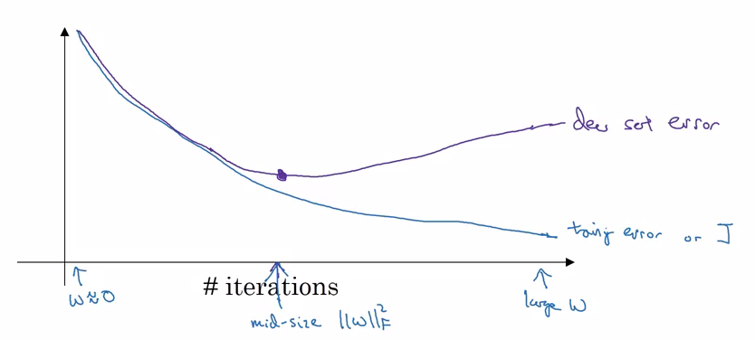
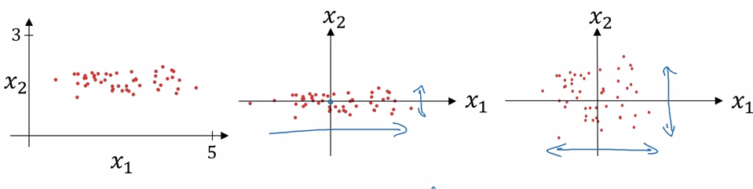
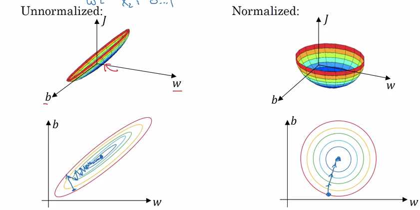
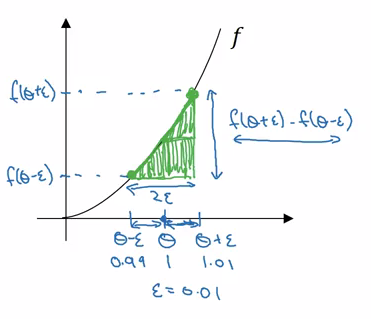

&copy;Copyright for [Shuang Wu] [2017] 
Cite from the [coursera] named [Neural network and Machine Learning] from [deeplearning.ai] 
Learning notes 

- [Setting up your ML app.](#setting-up-your-ml-app)
    - [Train / Dev / Test sets](#train-dev-test-sets)
    - [Bias and Variance](#bias-and-variance)
    - [Basic "recipe" for ML](#basic-recipe-for-ml)
- [Regularizing NN](#regularizing-nn)
    - [Regularization](#regularization)
    - [Why regularizationg reduces overfitting](#why-regularizationg-reduces-overfitting)
    - [Dropout regularization](#dropout-regularization)
    - [Understanding Dropout](#understanding-dropout)
    - [Other regularization methods](#other-regularization-methods)
- [Setting up optimization problem](#setting-up-optimization-problem)
    - [Normalizaing inputs](#normalizaing-inputs)
    - [Vanishing / Exploding gradients](#vanishing-exploding-gradients)
    - [Weight initialization for Deep nets.](#weight-initialization-for-deep-nets)
    - [Numerical approxm. of gradients](#numerical-approxm-of-gradients)
    - [Gradient checking](#gradient-checking)
    - [Gradient checking implementating notes](#gradient-checking-implementating-notes)

# Setting up your ML app.

## Train / Dev / Test sets

* Iterative process to find:
    * #of layers
    * #of hidden units
    * learning rates
    * activation
    * etc.

* Train / Dev / Test sets
    * Training set
        * pre: 70%/60%
        * big data: 98%/99.5%
    * Hold-out cros validation set (Development set)('dev')
        * pre: 20%
        * big data: 1%
    * Test set
        * pre: 30%/20%
        * big data: 1%

* Mismatched train/test distr.
    * training set:
        * cat picturec from webpages
    * Dev/test sets:
        * cat pictures from users using your app
    * then ditr. from this two set maybe different
    * Make sure dev and test come from same distribution
    * Not having a test set might be okay. (Only dev set.)
    
## Bias and Variance

* Hight bias
    * underfitting
        * Train set error: 15%
        * Dec set error:16%
* Just right
    * Train set error: 0.5%
    * Dec set error:1%
* High variance
    * overfitting
        * Train set error: 1%
        * Dec set error:11%
* Both high bais & variance:
    * Train set error: 15%
    * Dec set error:30%
* For human, optimal (Bayes) error: 15%
    * Blury image
    
## Basic "recipe" for ML

* If High bias (training data performance)
    * Try Bigger network
    * training longer
    * NN architecture search
* If High variance ( dev set performance)
    * try more data
    * try regularization
    * NN arch. search
    

# Regularizing NN

## Regularization

* logistic regression
    * L2 regularization
        * $+\frac{\lambda}{2m}\|w\|^2_2$
        * $\|w\|^2_2 = \sum_{j=1}^{n_x}w_j^2=w^Tw$
    * L1 regularization
        * $\frac{\lambda}{2m}\sum_{j=1}^{n_x}|w_j|=\frac{\lambda}{2m}\|w\|_1$
    * Lamda
        * regularization parameter

* NN
    * $+\frac{\lambda}{2m}\sum^L_{l=1}\|w^{[l]}\|^2_F$
    * Forbenius norm for matrix: 
        * $\|w^{[l]}\|^2_F=\sum_{i=1}^{n^{[l-1]}}\sum_{j=1}^{n^{[l]}}(w_{ij}^{[l]})^2$
    * GD:
        * $dw^{[l]} = \text{(from backprop)} + \frac{\lambda}{m}w^{[l]}$
        * $w^{[l]} := w^{[l]} - \alpha dw^{[l]}$
        * $\frac{\partial J}{\partial w^{[l]}}= dw^{[l]}$
        
## Why regularizationg reduces overfitting

* when $lambda$ is really large, may set those w close to zero, then zeroing out some hidden neurons which can from high variacne to high bias
    * smaller network
* when lambda large, the weights will be relative small, smake as z, then every layer will approx to linear and the whole NN will be near liner 

## Dropout regularization

* Dropout Regularization
    * Go through each layer, and set the probability of total numbers of neurons to 0
    * Repeat this process
* Implementing dropout ("Inverted dropout")
    * Illustrate w/ layer 3
        * keep_prob = 0.8
        * d3 = np.random.rand(a3.shape[0], a3.shape[1]) < keep.prob
        * a3 = np.multply(a3, d3)
        * a3 /= keep_prob
            * Ensure the expected value of a3 remain the same
* Making predictions at test time
    * no drop out
    
## Understanding Dropout

* Why dropout work?
    * Intuition: can't rely on any one feature, so have to spread out weights
        * shrink weights (L2)
* Can have low keep-prob for layer have lots of neurons which may cause overfitting, vice versa.
* good in compute vision
* Dropout is use for regularization, for overfitting

## Other regularization methods

* data augmentation
    * flippling image horizontally
    * rotation, cut, zoom in
* Early stopping
    * 
* Orthogonalization
    * Optimize cost func J
        * GD
    * Not overfit
        * Regularization
        * more data
    * these two can not independently 

# Setting up optimization problem

## Normalizaing inputs

* 2-step
    * subtract mean
        * $\mu=\frac{1}{m}\sum^m_{i=1}x^{(i)}$
        * $x:=x-\mu$
    * Normalize variance
        * $\sigma^2=\frac{1}{m}\sum^m_{i=1}(x^{(i)})^2$
        * $x /= \sigma^2$
* 
* Use the same $\mu$ and $\sigma^2$ from training set to normalize the test set

* why normalize inputs
    * range of the value make the elongate bowl or elongate func.
    * normalize will solve this problem and only need a  small learning rate
    * 
    * easier and faster to optimize
    
* Can always do this

## Vanishing / Exploding gradients

## Weight initialization for Deep nets.

* Single neuron e.g.
    * ReLU
        * $w^l=np.random.randn(shape)*np.sqrt(\frac{2}{n^{[l-1]}})$
    * large n $\rightarrow$ smaller $w_i$

## Numerical approxm. of gradients

* Checking derivative computation
    * 
        * $\frac{f(\theta+\epsilon)-f(\theta-\epsilon)}{2\epsilon}\approx g(\theta)$
        * Approx error: 0.0001

## Gradient checking

* For NN
    * Take W, b and reshape into a big vector $\theta$
    * Take dW, db and reshape into a big vector $d\theta$
    * for each i:
        * $d\theta_{approx}[i]= (J(\theta_1,\theta_2,\cdots,\theta_i+\epsilon,\cdots)-J(\theta_1,\theta_2,\cdots,\theta_i-\epsilon,\cdots))/2\epsilon$
        * $\approx d\theta[i]=\frac{\partial J}{\partial \theta_i}$
        * check $$\frac{\|d\theta_{approx}-d\theta\|_2}{\|d\theta_{approx}\|_2+\|d\theta\|_2}$$
            * $\approx 10^{-7}$ great
            * $\approx 10^{-5}$ 
            * $\approx 10^{-3}$ worry
            
## Gradient checking implementating notes

* Don't use in training - only to debug
* If algo. fails grad check, look at components to tro to identify bug
* Remember regularization
* Doesn't work w/ dropout
* Run at random initialization; perhaps again after some training
