&copy;Copyright for [Shuang Wu] [2017] 
Cite from the [coursera] named [Neural network and Machine Learning]from [deeplearning.ai] 
Learning notes 
- [Error Analysis](#error-analysis)
    - [Carrying out error analysis](#carrying-out-error-analysis)
    - [Cleaning up incorrectly labeled data](#cleaning-up-incorrectly-labeled-data)
    - [_**Build your first system quickly, then iterate**_](#build-your-first-system-quickly-then-iterate)
- [Mismatched training and dev/test set](#mismatched-training-and-devtest-set)
    - [Training and testing on different distributions](#training-and-testing-on-different-distributions)
    - [Bias and Variance w/ mismatched data distributions](#bias-and-variance-w-mismatched-data-distributions)
    - [Addressing data mismatch](#addressing-data-mismatch)
- [Learning From multiple tasks](#learning-from-multiple-tasks)
    - [Transfer learning](#transfer-learning)
    - [Mulri-task learning](#mulri-task-learning)
- [End-to-end deep learning](#end-to-end-deep-learning)
    - [What is end-toend-](#what-is-end-toend)

# Error Analysis

## Carrying out error analysis

* Look at dev e.g. to evaluate idea
    * Error analysis:
        * Get ~100 mislabeled dev set samples
        * Count up how many are dogs
* Evaluate multiple idea in parallel
    * Ideas for cat detection:
        * Fix pictures of dogs being recognized as cats
        * Fix great cats (lions, panthers, etc..) being misrecognized
        * Improve performance on blurry images

Image | Dog | Greate cats | Blury | Comment
------|-----|-------------|-------|--------
1 | check ||check| pitball
2 | | check |check| pitball
3 |  |check|check| raining day at zoo
... | check ||| pitball
% of total | 8% |43%|61%|

## Cleaning up incorrectly labeled data

* 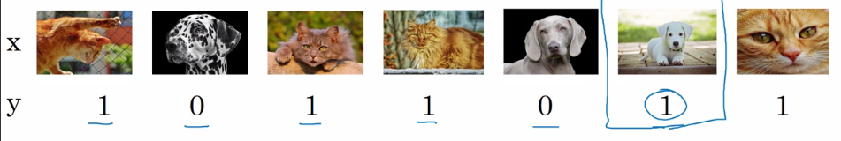
* Training set
    * DL algorithms are quite robust to _**random errors**_ in the training set
    * Systematic errors
* If in dev set or test set, use error analysis with the additional incorrectly labeled col
* 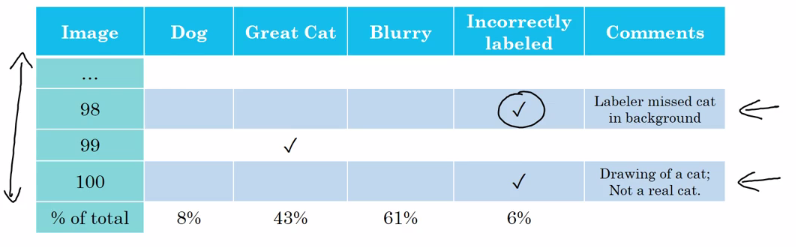
* look into these number
    * overall dev set error
    * Errors due incorrect label
    * Errors due to other causes
* Goal of dev set is to help you select b/w two classifiers A & B
* Correcting incorrect dev/test set examples
    * Apply same process to your dev and test sets to make sure they continue to come from the same distribution
    * Consider examining examples your algorithm got _right_ as well as ones it got _wrong_
    * Train and dev/test data may now come from slightly different distributions

## _**Build your first system quickly, then iterate**_
(This is the guideline)

* Speech recognition example
    * Noisy background
        * cafe noise
        * car noise
    * Accented speech
    * Far from microphone
    * Young children's speech
    * Stuttering
        * uh, ah, um, ...
    * ...
* How to build
    * Set up dev/test set and metric
    * Build initial system quickly
    * Use Bias/Variance analysis & Error analysis to prioritize next steps

# Mismatched training and dev/test set

## Training and testing on different distributions

* Cat app example
    * Data from webpages
        * $\approx200,000$
        * 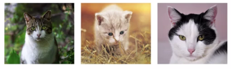
    * Data from mobile app (care about this)
        * 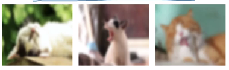
        * $\approx10,000$
    * option 1:
        * take all in one and randomly shuffle into train/dev/test
            * train: 205,000
            * dev 2,500
            * test 2,500
        * pos:
            * all come from same distribution
        * negs:
            * dev/test will manly come from the webpages instead of the care about, the mobile app
                * approx 2381 come from the webpages
                * 119 from the mobile app
        * not recommend, not what we care about
    * option 2:
        * train include 200,000 from web and 5000 from mobile app
        *  dev/test will both come out from mobile app
*  Speech recognition example
    *  speech  activated rearview mirror
    *  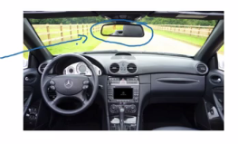
    * 
        Training Data | Dev/test
        --------------|---------
        Purchased data | Speech activated
        Smart speaker control | rearview mirror
        Voice keyboard | 
        ... | ...
        500,000 | 20,000
        * Can also have some from the rearview mirror and split equal for the dev/test

## Bias and Variance w/ mismatched data distributions

* Cat classifier example
    * Assume humans get $\approx 0\%$ error
        * Training error 1%
        * Dev error        10%
            * algorithm
            * different distribution
        * Training-dev set: same distribution as training set, but not used for training  (new subset data)
        * 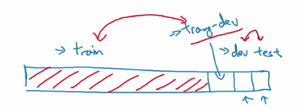
        * 
            Error type | Case 1 | Case 2 | Case 3 | Case 4
            ------- | ------- | ------- | ------- | -------
            Training error | 1% | 1% | 10% | 10%
            Training-dev error | 9% | 1.5% | 11% | 11%
            Dev error | 10% | 10% | 12% | 20%
             | high-variance | data-mismatch | high-biad | high-bias & high-variance

* Bias/variance on mismathced training and dev/test sets
    * 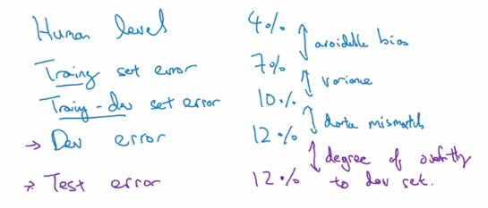
* More general formulation
    * Rearview mirror e.g.
    * 
 | | General speech recognition | Rear mirror speech data
-|------------|----------------------------|------------------------
human Level |"Human level" 4% | 6%
Error on e.g. trained on | "Training error" 7% |6% (bias when compare to$\uparrow$) 
Error on e.g. not trained on | "Training-dev error" 10%| "Dev/test error" 6% (variance when compare to$\uparrow$)(mismatch when compare to$\leftarrow$)

## Addressing data mismatch

* Addressing data mismatch
    * Carry out mamnual error analysis to try to understand difference b/w training and dev/test sets
        * E.g. mis-car noise
    * Make training data more similer; or collect more data similar to dev/test sets
        * e.g. similar noist in-car data

* Artificial data synthesis
    * sentence + car noise = Synthesized in-car audio
    * 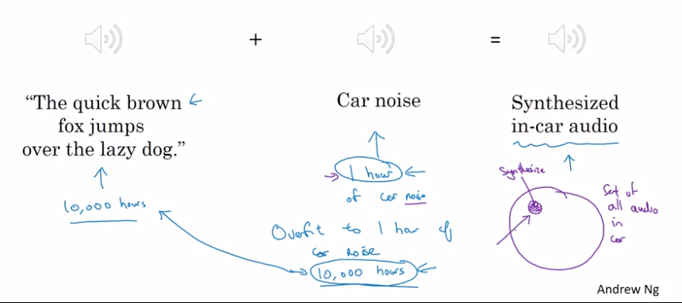
    * 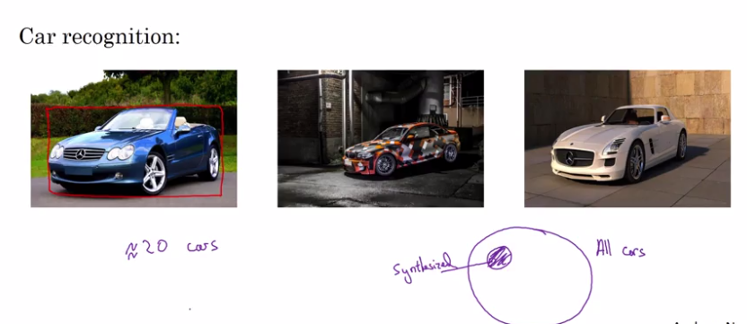

# Learning From multiple tasks

## Transfer learning

* Transfer learning
    * 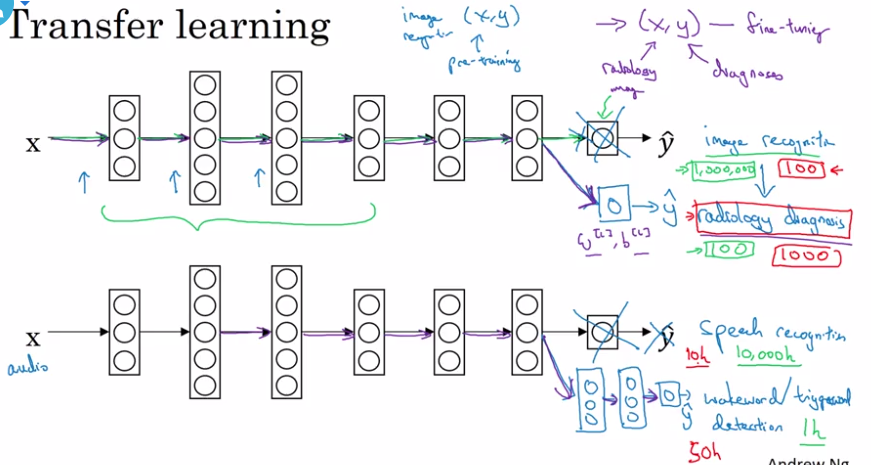
    * image recognition 
    * radiology diagnosis
    * Speech recognition to wakeword
    * idaa is transfer from lot of data to small set of data
* When transfer learning makes sense
    * task A and B have the same input x
    * You have a lot more data for Task A than Task B
    * Low level features from A could be helpful for learning B

## Mulri-task learning

* Simplified autonomous driving e.g.
    * Pedestrians
    * cars
    * stop signs
    * Traffic lights
    * etc...
    * 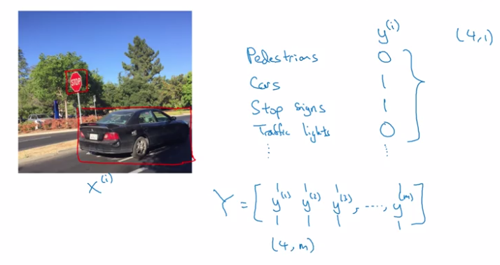
* NN architecture
    * 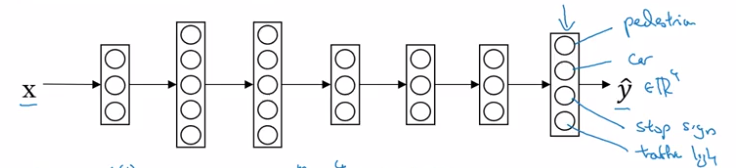
    * Loss: $\hat{y}^{(i)}=\frac{1}{m}\sum^m_{i=1}\sum^4_{j=1}l(\hat{y}^{(i)}_j,y_j^{(i)})$
        * use logistic loss
        * $-y^{(i)}_jlog\hat{y}^{(i)}_j-(1-{y}^{(i)}_j)log(1-\hat{y}^{(i)}_j)$
    * Unlike softmax regression
        * one image can have multiple labels
    * Multi-task learning
        * 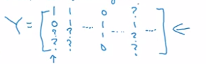
        * Sum only on valide label, ignore those ? in Y
* When multi-task learning makes sense
    * Training on a set of tasks that could benefit from having shared lower-level features
    * Usually: Amount of data you have for each task is quite similar
        * In transfer learning we usually transfer A w/ 1,000,000 to B with 1,000
        * For multiple $A_1$ with 1000, $A_2$ with 1000, ... $A_99$ with 1000, total 99,000 transfer to $A_100$ with 1000
        * Can train a big enough NN to do well on all the tasks
            * like one NN for cat detaction, one for stop sign, etc...

# End-to-end deep learning
## What is end-toend-